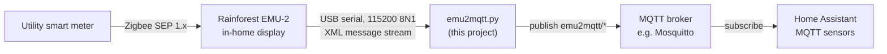

# emu2mqtt

Publishes live electricity data from a [Rainforest Automation EMU-2](https://www.rainforestautomation.com/rfa-z105-2-emu-2/)
in-home display to an MQTT broker. It runs as a small long-lived Python process next to the
broker and feeds Home Assistant's energy dashboard with real-time demand and cumulative
meter readings taken straight from the utility smart meter.

## Upgrading

`--mqtt_server` is now required and no longer has a default. An invocation that relied on the
old default must name the broker explicitly.

The availability topic is now published once per connection instead of being re-published
every second inside the poll loop. Home Assistant sees no difference; anyone who used that
once-a-second retained publish as a liveness heartbeat should watch the demand topic instead.

## The flow



The EMU-2 is already paired with the meter and shows the numbers on its own screen; this
bridge just takes the same data off the USB port and puts it on MQTT.

## What it does

`emu.py` opens the EMU-2's serial port and runs a reader thread that parses the device's
XML message blocks (`InstantaneousDemand`, `CurrentSummationDelivered`, `PriceCluster`, and
the rest of the Rainforest command set) into plain objects. `emu2mqtt.py` polls those
objects once a second and publishes any value whose device timestamp is newer than the last
one sent, so the broker sees a message per genuine meter update rather than one per second.

Every topic is under the root topic (`--mqtt_topic`, default `emu2mqtt`):

| Topic | Meaning | Units |
|-------|---------|-------|
| `<root>/lwt` | `online`, published retained on each broker connect; `offline` is the retained MQTT Last Will | — |
| `<root>/demand` | Instantaneous power draw; negative means exporting to the grid | Watts |
| `<root>/reading` | Net cumulative meter reading (`delivered − received`) | kWh |
| `<root>/readingd` | Cumulative energy **delivered** to the premises | kWh |
| `<root>/readingr` | Cumulative energy **received** from the premises (e.g. solar export) | kWh |
| `<root>/price` | Price reported by the meter, when the utility sends price data | $/kWh |

It is written to be left running unattended. The broker connection uses `connect_async`
with bounded exponential backoff (1–60 s), publishing pauses while the socket is down and
resumes on reconnect, and a reading dropped during an outage is re-sent afterwards because
the "last published" watermark only advances once the publish is accepted. Restarting the
broker — or Home Assistant with the Mosquitto add-on — does not need the bridge restarted.

The topics are plain values; there is no MQTT discovery payload, so the sensors are declared
in Home Assistant by hand (see below).

## Hardware

- A **Rainforest Automation EMU-2** (RFA-Z105-2), already commissioned with the electricity
  utility and joined to the smart meter over Zigbee. Pairing is done through the utility's
  web portal, not by this project.
- The EMU-2 plugged into the host over **USB**. It enumerates as a CDC-ACM serial device —
  on Linux normally `/dev/ttyACM0` (check `ls /dev/ttyACM*` or `dmesg` after plugging it in),
  on Windows a `COM` port. The link runs at 115200 baud, 8N1.
- Any host that can hold the USB device and reach the broker; a Raspberry Pi or other
  always-on Linux box is the usual home for it.
- **Python 3** and an MQTT broker (Mosquitto, or the Home Assistant Mosquitto add-on).

## Running it

```sh
pip install -r requirements.txt

python3 emu2mqtt.py \
    --mqtt_server mqtt.example.local \
    --mqtt_port 1883 \
    --mqtt_username myuser \
    --mqtt_password mypassword \
    --serial_port ttyACM0
```

| Flag | Default | Description |
|------|---------|-------------|
| `--mqtt_server` | *(required)* | MQTT broker hostname or address |
| `--mqtt_port` | `1883` | MQTT broker port |
| `--mqtt_username` | *(empty)* | MQTT username; omit both credential flags for an anonymous broker |
| `--mqtt_password` | *(empty)* | MQTT password |
| `--mqtt_client_name` | `emu2mqtt` | MQTT client ID |
| `--mqtt_topic` | `emu2mqtt` | Root topic for every published value |
| `--mqtt_qos` | `0` | QoS used for publishes and the Last Will |
| `--serial_port` | `ttyACM0` | Port the EMU-2 enumerates as — a name under `/dev/` on Linux, a `COM` port on Windows |
| `--debug` | off | Debug-level logging |

On startup it logs `Connected to EMU serial` and then one line per published message; with
`--debug` it also logs while it waits for the broker. `Ctrl-C` closes the MQTT connection
and stops the serial thread cleanly. The account running it needs read/write on the serial
device — on most distributions that means membership of the `dialout` group.

### As a systemd service

```ini
[Unit]
Description=Rainforest EMU-2 to MQTT bridge
After=network-online.target

[Service]
ExecStart=/usr/bin/python3 /opt/emu2mqtt/emu2mqtt.py --mqtt_server mqtt.example.local --serial_port ttyACM0
WorkingDirectory=/opt/emu2mqtt
Restart=always
RestartSec=10
User=emu2mqtt

[Install]
WantedBy=multi-user.target
```

### Home Assistant sensors

```yaml
mqtt:
  sensor:
    - name: "Home Power Demand"
      state_topic: "emu2mqtt/demand"
      unit_of_measurement: "W"
      device_class: power
      availability_topic: "emu2mqtt/lwt"
    - name: "Home Energy Consumed"
      state_topic: "emu2mqtt/readingd"
      unit_of_measurement: "kWh"
      device_class: energy
      state_class: total_increasing
      availability_topic: "emu2mqtt/lwt"
    - name: "Home Energy Returned"
      state_topic: "emu2mqtt/readingr"
      unit_of_measurement: "kWh"
      device_class: energy
      state_class: total_increasing
      availability_topic: "emu2mqtt/lwt"
```

Those are the two the Home Assistant energy dashboard wants: `emu2mqtt/readingd` as grid
consumption and `emu2mqtt/readingr` as the matching return to grid. Both only ever climb, so
`state_class: total_increasing` is correct for them. `emu2mqtt/reading` is the *net* figure
(`readingd − readingr`) and falls whenever the premises export, so give it
`state_class: total` if you declare it at all — `total_increasing` reads a fall as a meter
reset.

## Layout

| Path | What it is |
|------|-----------|
| `emu2mqtt.py` | The bridge — argument parsing, the MQTT client, and the publish loop |
| `emu.py` | Serial driver for the EMU-2: the command vocabulary, the reader thread, and the XML block parser |
| `api_classes.py` | The small classes each XML message block is turned into |
| `requirements.txt` | Python dependencies |
| `LICENSE` | MIT Licence, covering this project's own code |
| `LICENSE-APACHE-2.0` | Apache Licence 2.0 — covers the parts of `emu2mqtt.py` that come from emu2influx |
| `NOTICE` | Which code is under which licence, and the attribution for the vendored files |

## Device documentation

The EMU-2's serial protocol is described in Rainforest Automation's own technical guide and
datasheets. Those documents are theirs and are not redistributed here — get them from
Rainforest.

## Credits and licence

This repository contains code under more than one licence. Read [NOTICE](NOTICE) before
reusing any of it; in short:

- **This project's own code** — `emu2mqtt.py`, this documentation, and everything not listed
  below — is **MIT**, see [LICENSE](LICENSE).
- **`emu.py` and `api_classes.py`** come from
  [Emu-Serial-API](https://github.com/rainforestautomation/Emu-Serial-API) by Rainforest
  Automation, Inc. `api_classes.py` is that project's file unchanged apart from an added
  attribution header; `emu.py` is that project's own `emu.py`, modified here. Both carry a
  header saying so. **That project publishes no licence — it has no LICENSE file and states
  no terms — so no reuse rights are granted by its authors, and none are granted here.**
  The two files are included for convenience, because the bridge is useless without them,
  with full attribution and no claim of ownership. If you would rather take them from the
  source, get them from the Rainforest repository above; they are drop-in.
- **Parts of `emu2mqtt.py`** come from [emu2influx](https://github.com/abaker/emu2influx) by
  Alex Baker, licensed under the **Apache Licence 2.0**: the EMU-2 message handling and its
  helpers (the epoch constant and the timestamp, reading and price functions) and the shape
  of the polling loop. **Those portions remain under the Apache Licence 2.0**, a copy of
  which is included as [LICENSE-APACHE-2.0](LICENSE-APACHE-2.0). The MQTT client, the Home
  Assistant topic layout, the reconnect and backoff handling and the rest of the file are
  this project's own work and are MIT.

GitHub labels a repository from its `LICENSE` file, so this one shows as MIT. That label is
not the whole story: the two vendored files carry no stated terms at all, and parts of
`emu2mqtt.py` stay under the Apache Licence 2.0. [NOTICE](NOTICE) is the authority on which
file — and which part of a file — is under what.
